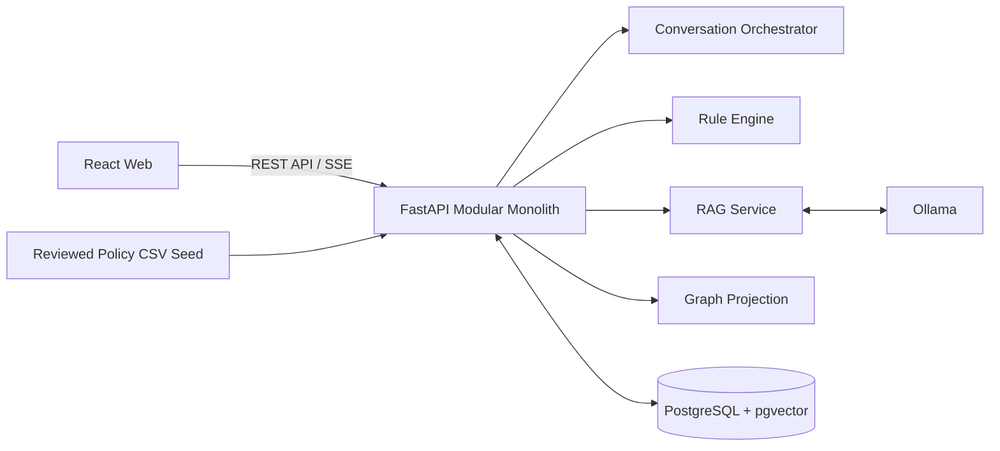

# 시스템 개요

## 단일 저장소 기준

「나만 결혼해?」 MVP는 React Web, FastAPI Backend, 검수된 정책 CSV 기준 데이터, PostgreSQL + pgvector, Ollama, Docker Compose 로컬 인프라를 하나의 Git 저장소에서 관리한다.

배포 단위와 실행 프로세스는 프론트엔드, 백엔드, 인프라로 나뉜다. 정책 CSV 기준본은 백엔드 배포에 포함한다.

## 왜 MSA가 아닌가

현재 MVP는 정책 탐색, 질문, RAG, 판정, 설명의 계약이 자주 함께 바뀐다. 이를 독립 서비스로 쪼개면 API 계약과 데이터 소유권 조정 비용이 커진다. 따라서 백엔드는 FastAPI 모듈러 모놀리스로 시작하고, 모듈 경계만 명확히 둔다.

## 시스템 흐름

## React Web

React Web은 사용자 UI와 브라우저 상태를 소유한다. 챗봇 패널, 정책 그래프, 정책 상세, 내 정책, 저장 정책, 알림 상태, 확인이 필요한 사용자 정보 입력, 판정 결과와 정책 근거 확인 화면으로 확장한다.

백엔드와는 REST API 및 SSE로 통신한다. 현재 명확한 요구가 없으므로 WebSocket은 도입하지 않는다.

## FastAPI Backend

FastAPI는 MVP 백엔드의 단일 애플리케이션이다. 내부 모듈은 Conversation Orchestrator, Question Engine, Rule Engine, RAG Service, Graph Projection, Saved Policy, Notification, 사용자 사실 정보, 정책 판정 결과, 정책 원문과 판정 근거 조회, SSE, Health Check, 설정, 구조화 로그 책임으로 확장한다.

Phase 0 구현은 `main.py`, API Router, Health Check, 설정 로딩, 구조화 로그, 공통 오류, Rule Engine의 최소 판정 규칙으로 제한한다.

## PostgreSQL과 pgvector

PostgreSQL은 `category`, `policy`, `question`, `user_fact`, `policy_rule`, `policy_evaluation`, `policy_relation` 같은 정형 데이터를 관리한다. 실제 테이블 이름은 데이터 설계 문서 확정 시 우선한다.

pgvector는 PostgreSQL 확장으로 `policy_document`, `document_chunk`, `document_chunk_embedding`, FAQ, 공고문, 안내문, 정책 원문 청크 검색 데이터를 관리한다. 별도 벡터 DB는 도입하지 않는다.

## Ollama

Ollama는 로컬 생성 모델과 임베딩 모델 실행 환경이다. 기본 후보는 `qwen3:4b`, `qwen3-embedding:0.6b`이며 환경변수로 관리한다.

Ollama는 조건 후보 추출 보조, 자연어 질문 이해, 검색 질의 보정, 판정 설명 생성에 사용한다. 최종 자격 상태는 Rule Engine이 계산한다.

## 정책 CSV 기준 데이터

MVP는 별도 수집·정규화 파이프라인을 실행하지 않는다. 관리자 검수를 거친 `backend/data/policy-seed`의 CSV를 백엔드가 시작 시 직접 로딩한다.

로더는 정책·질문·Rule·관계·RAG 문서의 ID와 참조 무결성을 검증한다. 변동 기준 placeholder는 공식 확인 필요로 분리하며 확정 판정에 사용하지 않는다.

백엔드는 웹 요청 중 외부 원문을 수집하거나 CSV를 변경하지 않는다. 청크·임베딩 생성은 현재 범위가 아니다.

## 향후 분리 가능한 경계

트래픽, 배치 처리량, 운영 권한, 배포 주기가 충분히 달라질 때 프론트엔드 배포, 백엔드 API, 정책 파이프라인 job, 인프라를 배포 단위로 분리할 수 있다. 저장소 분리는 Phase 0 결정 사항이 아니다.
