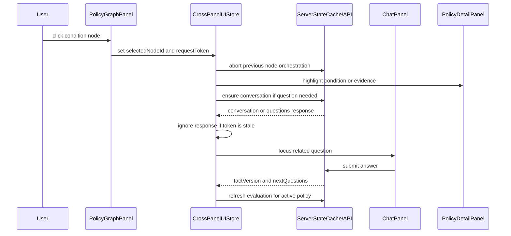

# Frontend Phase F0 Plan

## Goal

Define the screen responsibilities and state structure so the chatbot and policy graph operate as one user flow.

## Scope

- Define the screen list for `NavigatorPage`.
- Define component ownership boundaries.
- Separate global/server state, cross-panel UI state, and local UI state.
- Define frontend API mock contracts.
- Define the server-state and UI-state management pattern.
- Define loading, error, and empty states.
- Define accessibility and responsive criteria.
- Define the conversation flow after a graph node click.

## Screen Structure

```text
NavigatorPage
├── CategorySelector
├── ChatPanel
├── PolicyGraphPanel
├── PolicyDetailPanel
└── SessionControl
```

## Component Responsibilities

| Component | Responsibility | Does not own |
| --- | --- | --- |
| `NavigatorPage` | Composes the screen, reads cross-panel UI state, and dispatches high-level user intents such as policy selection and graph node selection. | Rendering internals for chat, graph, or detail sections; storing all panel state in local component state. |
| `CategorySelector` | Renders policy category and filter choices and reports filter changes. | Policy evaluation or user fact collection. |
| `ChatPanel` | Renders conversation questions, answer inputs, answer submission, conflicts, and follow-up prompts. | Eligibility calculation or graph projection. |
| `PolicyGraphPanel` | Renders policy, condition, question, and evidence nodes from backend graph projection. | Creating graph relationships or deciding final eligibility. |
| `PolicyDetailPanel` | Renders policy metadata, source metadata, evaluation state, condition status, and evidence references. | Session lifecycle or answer normalization. |
| `SessionControl` | Starts, resets, and ends anonymous browser sessions. | Displaying raw session identifiers. |

## State Architecture

F0 defines three state layers so `NavigatorPage` does not become a God Component:

| Layer | Owner | Examples | Rule |
| --- | --- | --- | --- |
| Global/server state | TanStack Query or an equivalent server-state cache | Session expiry, policies, graph data, conversation questions, evaluations, evidence | Fetched by API client hooks with stable query keys and invalidation rules. |
| Cross-panel UI state | A dedicated UI store using Zustand or React Context with selectors | `selectedCategoryId`, `activePolicyId`, `selectedNodeId`, `activePanel`, highlighted evidence id | Shared only when more than one panel needs the value. Store selectors must avoid rerendering unrelated panels. |
| Local UI state | Component-local React state | Draft chat input, hovered node, graph zoom, opened menu, copied-link feedback | Remains inside the owning component unless another panel needs it. |

Zustand is preferred for cross-panel UI state once implementation begins because selector-based subscriptions reduce rerenders between chat, graph, and detail panels. React Context is acceptable only if the context is split by concern and consumed through narrow selectors or memoized adapter hooks.

`NavigatorPage` may coordinate events, but it should not directly own chat message input, graph viewport state, expanded detail sections, or every pending flag.

## Server State

Server state is fetched from backend contracts and cached or invalidated by the frontend:

- Anonymous session expiry from `POST /api/session`.
- Policy summaries from `GET /api/policies`.
- Policy detail from `GET /api/policies/{policyId}`.
- Policy graph projection from `GET /api/policies/{policyId}/graph`.
- Conversation id, next questions, fact version, and conflicts from conversation endpoints.
- Evaluation summaries and evidence from evaluation endpoints.

### Server State Query Keys

| Component | Server state | Query or mutation key |
| --- | --- | --- |
| `NavigatorPage` | Session expiry | `["session"]` |
| `CategorySelector` | Policy summaries | `["policies", { "region": region, "lifeEvent": lifeEvent, "cursor": cursor }]` |
| `ChatPanel` | Conversation questions and answer response | `["conversation", conversationId]`, `["conversationAnswers", conversationId]` |
| `PolicyGraphPanel` | Graph projection | `["policyGraph", activePolicyId]` |
| `PolicyDetailPanel` | Policy detail and evaluation detail | `["policy", activePolicyId]`, `["evaluation", evaluationId]` |
| `SessionControl` | Session lifecycle mutations | `["session", "reset"]`, `["session", "delete"]` |

Mutation success rules:

- Answer submission invalidates `["conversation", conversationId]` and evaluation queries for the active policy.
- Session reset clears session-dependent queries: conversations, evaluations, and active policy-specific derived views.
- Policy selection changes `activePolicyId` and enables policy detail and graph queries for that policy.

## UI State

UI state is local browser state and must not be treated as authoritative domain state:

- Selected category and filter controls.
- Active policy id.
- Active graph node id.
- Hovered and keyboard-focused graph node.
- Expanded evidence rows and selected detail tab.
- Draft chat answer.
- Pending request indicators.
- Retry visibility and reset confirmation dialog.
- Responsive layout mode.

### Cross-Panel and Local UI State

| Component | Cross-panel UI state | Local UI state |
| --- | --- | --- |
| `NavigatorPage` | Reads `selectedCategoryId`, `activePolicyId`, `selectedNodeId`, `activePanel` | None beyond route-level composition flags. |
| `CategorySelector` | Writes `selectedCategoryId` | Opened selector, keyboard highlight. |
| `ChatPanel` | Reads `activePolicyId`, `selectedNodeId`; may write `activePanel` after a graph node focuses a question | Draft answer text, focused question input, local submit-disabled state. |
| `PolicyGraphPanel` | Reads and writes `selectedNodeId`; reads `activePolicyId` | `hoveredNodeId`, `zoomLevel`, pan offset, keyboard focus position. |
| `PolicyDetailPanel` | Reads `activePolicyId`, `selectedNodeId`, highlighted evidence id | Expanded evidence rows, selected detail tab, copied-link feedback. |
| `SessionControl` | May clear cross-panel state after reset/delete | Reset confirmation dialog, button pending state. |

## API Mock Contract

Frontend F0 mock contracts are defined in `docs/contracts/frontend-f0-api-mocks.md`.

The mock contract is intentionally limited to the draft endpoints already described in `docs/architecture/api-contracts.md`. It adds only frontend usage rules, graph node/edge mock shape, MSW handler requirements, loading/error/empty states, and graph-click orchestration. It does not implement backend endpoints or introduce persisted data models.

MSW is the F0 standard for frontend API mocking once implementation begins. Mock handlers must live under a frontend-owned mock boundary such as `frontend/src/mocks/handlers.ts` and intercept the same HTTP paths used by production API clients.

## Loading, Error, and Empty States

Each screen must define these states before implementation:

- Loading: request-specific pending state, without clearing unrelated successful data.
- Error: safe error envelope display with retry, without exposing raw server details.
- Empty: explicit no-data state that does not imply ineligibility or fabricate eligibility.

Detailed area-level states are recorded in `docs/contracts/frontend-f0-api-mocks.md`.

## Graph Node Click Flow

Graph node clicks are interpreted by node type:

- `policy`: select policy and open detail.
- `condition`: highlight condition and evidence; if facts are missing, focus the related question in chat.
- `question`: focus the matching chat input.
- `evidence`: open or highlight the source reference in policy detail.

When a condition or question requires a conversation and no conversation exists, `NavigatorPage` creates one through `POST /api/conversations` using the selected policy context. Answer submission updates facts and triggers a fresh evaluation request with a new idempotency key.

### Async Ordering and Race Handling

Graph node selection is a user intent with a monotonic request token:

| Step | Event | State transition | Async guard |
| --- | --- | --- | --- |
| 1 | User clicks node A | Set `selectedNodeId=A`, set related panels pending. | Abort any in-flight graph-click orchestration for the previous node. |
| 2 | Load detail/evidence context | Enable or refetch detail and graph-dependent queries for the current `activePolicyId`. | Ignore responses whose token does not match the latest `selectedNodeId` token. |
| 3 | Ensure conversation | If a chat question is needed and no conversation exists, call `POST /api/conversations`. | Use `AbortController` where supported; otherwise compare token before writing UI state. |
| 4 | Focus chat or detail target | Set `activePanel` and highlight target question/evidence. | Apply only if `selectedNodeId` is still the clicked node. |
| 5 | Submit answer | Call answer mutation, then evaluation mutation. | Invalidate only queries for the current session, policy, and fact version. |

Implementation phases must cancel stale requests with `AbortController` for fetch-backed clients. When a library cannot physically cancel the work, completion handlers must check the latest selected-node token before updating cross-panel UI state.



## Responsive Layout

| Breakpoint | Layout | Panel priority |
| --- | --- | --- |
| `< 768px` mobile | Tab or drawer-based layout. One primary work panel is visible at a time. | `ChatPanel`, `PolicyGraphPanel`, `PolicyDetailPanel`, then `SessionControl`; `CategorySelector` remains compact at the top. |
| `768px - 1199px` tablet | Two-pane split layout. Chat and graph are primary; detail opens as a drawer or lower panel. | Keep active chat question and selected graph node visible without horizontal scroll. |
| `>= 1200px` desktop | Three-column split layout: category/session rail, graph workspace, chat/detail side panel or graph + chat + detail depending on density. | Graph and chat remain simultaneously visible; detail can be pinned when a policy is selected. |

Mobile tab state belongs to cross-panel UI state as `activePanel`; graph zoom and drawer scroll position remain local state.

## Completion Criteria

- Each screen's API usage is defined.
- Loading, error, and empty states are defined.
- Graph node click to chat flow is defined.
- Global/server state, cross-panel UI state, and local UI state are explicitly separated.
- Server-state cache keys and cross-panel UI store ownership are defined.
- Race-condition handling for graph node click orchestration is defined.
- MSW-based mock expectations are defined.
- F0 status and verification are recorded in this phase folder.

## Out of Scope

- Implementing production graph rendering.
- Implementing backend endpoints beyond existing contracts.
- Adding SQLAlchemy models or Alembic migrations.
- Adding saved policy or notification contracts.
- Introducing WebSocket.
- Persisting frontend UI state beyond the browser session.
